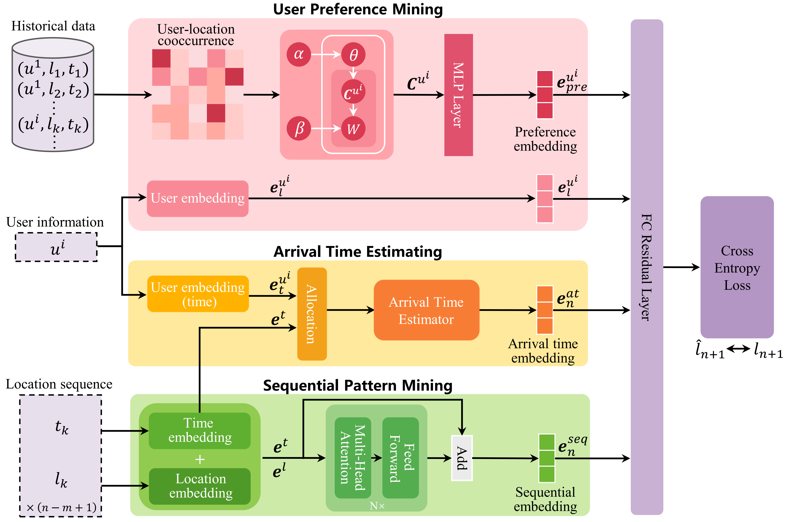

## MCLP

This is the PyTorch implementation of the Multi-Context aware Location Prediction model (MCLP) and helps readers to reproduce the results in the paper "**Going Where, by Whom, and at What Time: Next Location Prediction Considering User Preference and Temporal Regularity**".

* Model Framework
<p align="middle" width="100%">
  
</p>

### Configurations
For both datasets, the embedding dimensions of the proposed model are set to 16.  
The Transformer encoder consists of 2 layers, each with 4 attention heads and a dropout rate of 0.1.  
The Arrival Time Estimator has 4 attention heads.  
We train MCLP for 50 epochs with a batch size of 256. 

### Requirements
The runtime environment can be viewed in requirements.txt or by executing the following command:
```shell
pip install -r requirements.txt
```

### Hyperparameters
All hyperparameter settings are saved in the `.yml` files under the respective dataset folder under `saved_models/`. \
\
For example, `saved_models/TC/settings.yml` contains hyperparameter settings of MCLP for Traffic Camera Dataset. 

### Run
#### The following is a run of Traffic Camera Dataset (Mobile Phone Dataset is similarly provided):
- Unzip `data/TC.zip` to `dataset/TC`. The two files are training data and testing data.

- For MCLP model:
  ```shell
  python ./model/run.py --dataset TC --dim 16 --topic 400 --at attn
  ```
- For MCLP(LSTM) model:
  ```shell
  python ./model/run.py --dataset TC --dim 16 --topic 400 --at attn --encoder lstm
  ```
### Citation
```
@inproceedings{sun2024going,
  title={Going Where, by Whom, and at What Time: Next Location Prediction Considering User Preference and Temporal Regularity},
  author={Sun, Tianao and Fu, Ke and Huang, Weiming and Zhao, Kai and Gong, Yongshun and Chen, Meng},
  booktitle={Proceedings of the 30th ACM SIGKDD Conference on Knowledge Discovery and Data Mining},
  pages={2784--2793},
  year={2024}
}
```
