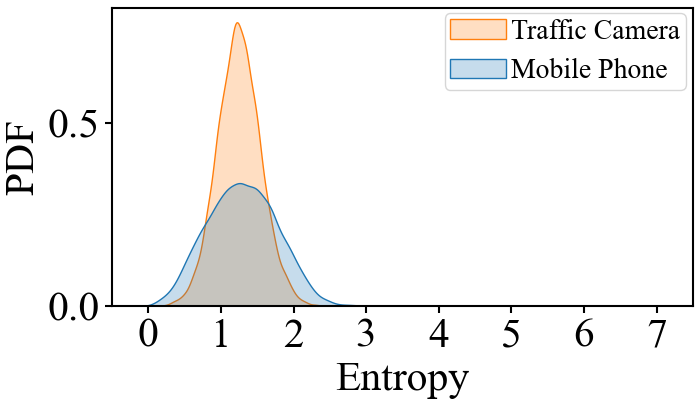
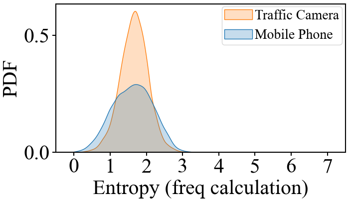

# MCLP

This is the PyTorch implementation of the paper "Going Where, by Whom, and at What Time: Next Location Prediction Considering User Preference and Temporal Regularity"

### Configurations
For both datasets, the embedding dimensions of the proposed model are set to 16.  
The Transformer encoder consists of 2 layers, each with 4 attention heads and a dropout rate of 0.1.  
The Arrival Time Estimator has 4 attention heads.  
We train MCLP for 50 epochs with a batch size of 256. 

### Temporal Context on Mobility Entropy
<div style="display:flex">
    <div style="flex:35%;padding:5px;text-align:center;">
        
        <p style="margin-top:5px;">Average Calculation</p>
    </div>
    <div style="flex:35%;padding:5px;text-align:center;">
        
        <p style="margin-top:5px;">Frequency Calculation</p>
    </div>
</div>


### Parameter Analysis
This is a supplementary parameter analysis conducted on the Traffic Camera Dataset, exploring the effects of various dimensions, including location/time, user, and the number of Transformer encoder layers.

<div style="display:flex; text-align: center;">
    <div style="flex:33.33%;padding:5px;">
        
        <p style="margin-top:5px;">Location/Time Dimension</p>
    </div>
    <div style="flex:33.33%;padding:5px;">
        
        <p style="margin-top:5px;">User Dimension</p>
    </div>
    <div style="flex:33.33%;padding:5px;">
        
        <p style="margin-top:5px;">Num. of Encoder Layer</p>
    </div>
</div>


### Requirements
The runtime environment can be viewed in requirements.txt or by executing the following command:
```shell
pip install -r requirements.txt
```

### Hyperparameters
All hyperparameter settings are saved in the `.yml` files under the respective dataset folder under `saved_models/`. \
\
For example, `saved_models/TC/settings.yml` contains hyperparameter settings of MCLP for Traffic Camera Dataset. 

### Run
#### The following is a run of Traffic Camera Dataset (Mobile Phone Dataset is similarly provided):
- Unzip `data/TC.zip` to `dataset/TC`. The two files are training data and testing data.

- For MCLP model:
  ```shell
  python ./model/run.py --dataset TC --dim 16 --topic 400 --at attn
  ```
- For MCLP(LSTM) model:
  ```shell
  python ./model/run.py --dataset TC --dim 16 --topic 400 --at attn --encoder lstm
  ```
#### Study of Different Variants:
- For Base model:
  ```shell
  python ./model/run.py --dataset TC --dim 16
  ```
- For +Pre model:
  ```shell
  python ./model/run.py --dataset TC --dim 16 --topic 400
  ```
- For +At model :
  ```shell
  python ./model/run.py --dataset TC --dim 16 --at attn
  ```

#### Study of Different Arrival Time Estimators:
- For Static model :
  ```shell
  python ./model/run.py --dataset TC --dim 16 --at static
  ```
- For True model :
  ```shell
  python ./model/run.py --dataset TC --dim 16 --at truth
  ```
